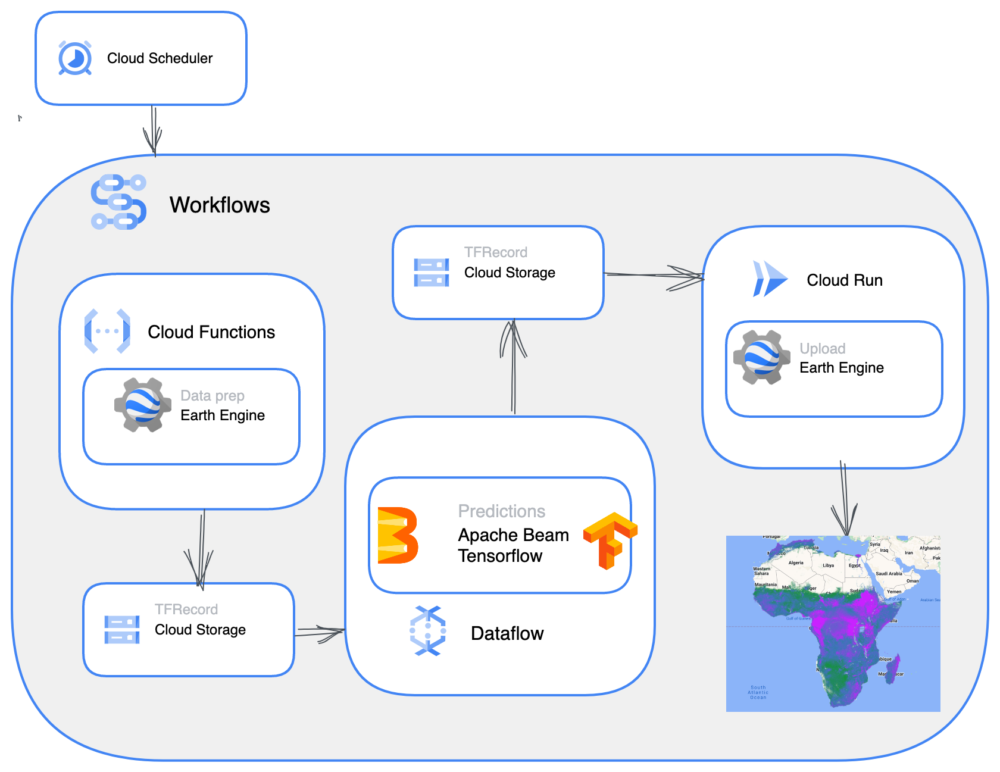

# earthengine-workflow
### Deploy Tensorflow models into production on Google Cloud Platform for automating predictions on Earth Engine imagery.

This repo contains an example of deploying a trained Tensorflow model into production on Google Cloud Platform for making predictions on [Earth Engine](https://earthengine.google.com/) imagery. A high-level overview of the steps

1. A [cloud function](https://cloud.google.com/functions/) calls the Earth Engine Python API, initiating the export of remote sensing imagery ready for input into the prediction pipeline.

2. A [dataflow](https://cloud.google.com/dataflow) job makes predictions on this input using a trained tensorflow model. Prediction is parallelized across workers.

3. A [cloud run](https://cloud.google.com/run/) service uploads the predictions back into into Earth Engine.

These steps are stiched together into a workflow using [Google Cloud Workflows](https://cloud.google.com/workflows). Workflows orchestrates the execution of the jobs and polls services to check for completion before passing results to the next step.

The benefits of this pipeline are:

- _Massive scalability_: 

Processing and export of remote sensig data is offloaded to Earth Engine, allowing efficient querying and analysis of imagery. The number of workers for the dataflow prediction job will autoscale based on the size of the input data up to a limit that we can set. 

- _Low cost_: 

The entire pipeline is built on serverless, managed and autoscaled services. This is well suited to the infrequent, large-scale prediction jobs that are typical of remote sensing pipelines. When a prediction is needed services are scaled up to massive sizes, when nothing is happening (most of the time), nothing is running and no costs are incurred.

This repo is intended as a demonstation of this processing pipeline, and builds on the basic Earth Engine tutorial for training Tensorflow models on data from Earth Engine available [here](https://github.com/google/earthengine-api/blob/master/python/examples/ipynb/TF_demo1_keras.ipynb). The trained model used here is exported from this tutorial.

For another example of a similar processing pipeline see [Global Renosterveld Watch](https://github.com/mgietzmann/global_renosterveld_watch).

An outline of this repo:

### [ee_function](ee_function/) 
contains files to deploy the functon for exporting imagery from Earth Engine to Google CLoud Storage. 
It makes an Earth Engine API call that downloads transformed layers of satellite data into cloud storage. The layers are downloaded as GZIPed TFRecords. The size of these records are controlled by a `maxFileSize` parameter which allows us to, in turn, control the batch size of the data throughout the pipeline. In addition to the TFRecords, a `mixer.json` file is also downloaded which is used on upload (final stage of the pipeline) to allow the Earth Engine API to reconstitute the spatial relationships in the layers.

### [ee_predict](ee_predict/) 
contains files to deploy the dataflow job. This is defined by the dataflow template which is essentially just a dockerized apache beam job. As we are processing this data using parallelization across workers there is no longer any guarantee that our data remains in the right order. This is a significant issue because Earth Engine is expecting the data back in the same order we downloaded it in. Therefore one critical component of the pipeline is to attach a key to each data record that will allow us to reconstitute the ordering before upload. Predictions are made using the Apache Beam RunInference API. Predictions are written to a cloud storage bucket for use by the upload step.

### [ee_upload](ee_upload/) 
contains files to deploy the Cloud Run service that uploads the predictions back to an Earth Engine image collection. We can't use cloud functions here because the upload call has to be done with the CLI and cloud functions don't give us finegrained access to the CLI. Cloud run allows us to dockerize our upload function and serve it as an API. The upload service finds the appropriate TFRecords and `mixer.json` file and calls the upload Earth Engine API to create a new asset with our prediction layers.

[eeworkflow.yaml](eeworkflow.yaml) is the Google Cloud workflow that orchestrates this pipeline. It starts the process by requesting the export of imagery. Then it polls the export task to check for completion. When exporting is done, it starts the Dataflow prediction job and polls this job to check for completion. When prediction is done it starts the upload job and returns the upload task id. In the .yaml file we set the worker type and max number of workers that we would like for our dataflow prediction job.

[setup.sh](setup.sh) sets up all the necessary permissions and deploys all the services. The final step of this script to to deploy a [Google Cloud Sheduler](https://cloud.google.com/scheduler) which will repeatedly call the workflow as make predictions on new imagery at the desired frequency.

Look out for an upcoming blog post with a full rundown of deployment and design choices.